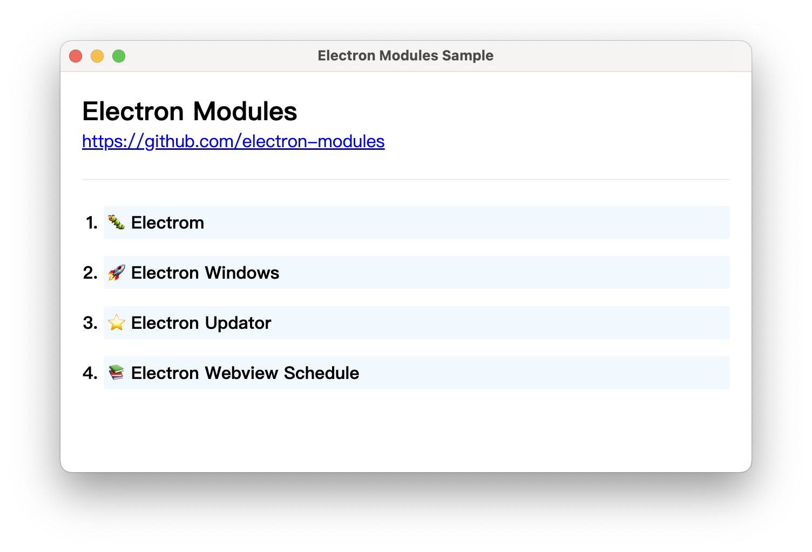

# electron-modules-sample

---

[![CI][CI-image]][CI-url]

[CI-image]: https://github.com/electron-modules/electron-modules-sample/actions/workflows/ci.yml/badge.svg
[CI-url]: https://github.com/electron-modules/electron-modules-sample/actions/workflows/ci.yml

The All-In-One sample for https://github.com/electron-modules

<p align="center">
  
</p>

## Develop

```bash
$ npm run dev
```

<!-- GITCONTRIBUTOR_START -->

## Contributors

|[<br/><sub><b>xudafeng</b></sub>](https://github.com/xudafeng)<br/>|[<br/><sub><b>snapre</b></sub>](https://github.com/snapre)<br/>|[<br/><sub><b>vagusX</b></sub>](https://github.com/vagusX)<br/>|
| :---: | :---: | :---: |


This project follows the git-contributor [spec](https://github.com/xudafeng/git-contributor), auto updated at `Mon Apr 24 2023 10:28:14 GMT+0800`.

<!-- GITCONTRIBUTOR_END -->
